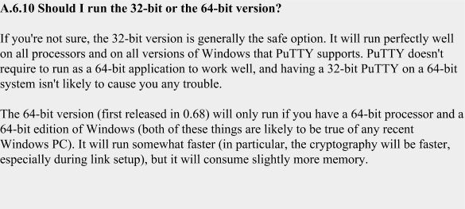
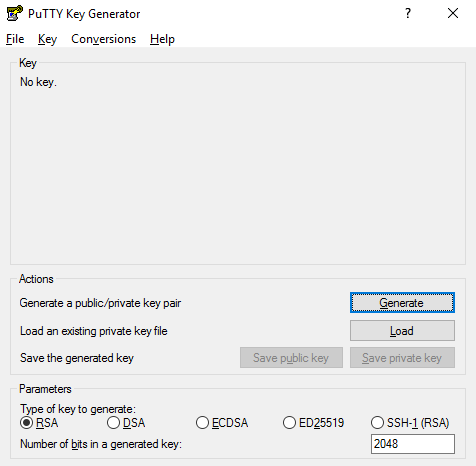
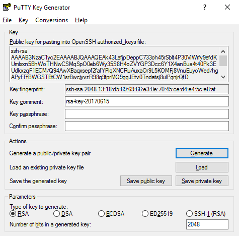
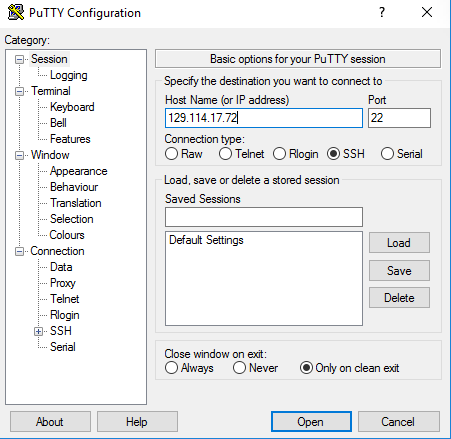
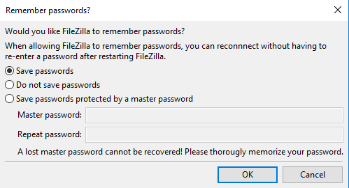
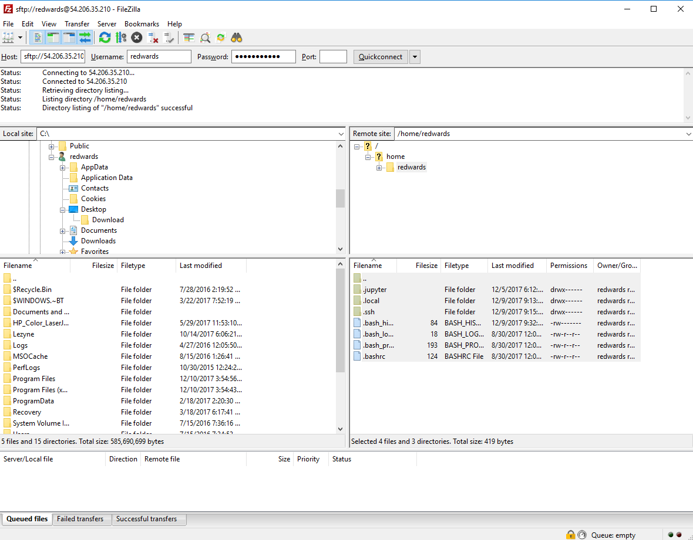
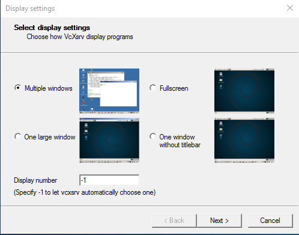
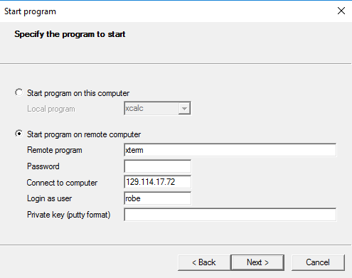
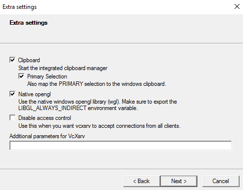
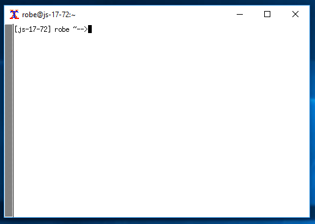

# Linux

## Introduction to Linux


Most computational biologists use either [Apple Macs](http://www.apple.com/) or [Linux](http://www.linux.org/) machines. There are a couple of reasons for this:
* Much of the software is free
* Many of the tools require a command line to use
* Many of the tools require large compute resources, either a cluster or lots of memory

It is probably the last reason that dominates many of the discussions: many of the software tools you will want to use require more resources than your laptop or desktop machine can provide. You can definitely run the BLAST suite of programs on your laptop, but for large data sets like a whole metagenome, you probably want to run that on a server so that you can go and do other things while the program is running.


Most servers that you will access run the operating system linux, or a similar variant of the Unix operating system. Linux was started in 1991 as a PhD project by Linus Torvalds, and the initial release was not very powerful, however Linus released his software using an open source license that allows anyone to use and modify the source code, either commercially or not. This meant that other developers could pick up on his work, and several groups and companies developed operating systems based on the linux kernel (the piece that does all the work). RedHat has had the most success in the so-called enterprise sphere (selling servers to companies), and because RedHat’s Fedora software is built on open-source software, it also releases all of its changes and updates. There is a free version of RedHat’s operating system, called CentOS, that many servers use (especially those in academic settings!). CentOS is designed with performance in mind, and is designed to be run on servers that are very rarely rebooted. Therefore, only essential system changes are made between releases of the operating system. Another flavor of Linux is called Debian (after founder Ian Murdock and his then-girlfriend Debra) developed some elegant mechanisms to keep the software up-to-date. Again, Debian was built on free software, and a company (Canonical) built a smooth graphical user interface, and easy, graphical installation system, and released the software as Ubuntu. There are many connections between Ubuntu, Debian, CentOS, and Fedora, and most users can’t really tell which operating system they are using – they are all canonically called Linux!

The reason that we are using Linux for the course is because it is open and free, there is lots of software available for it, and it will help you become familiar with the servers you will doubtless use for high-performance computing. In addition, we can provide you with a server that you can start and it already has everything installed for you!

## Public and Private SSH keys

You are probably used to using passwords to access websites, servers, and computers. Passwords are common because they are simple, but they are not very good. Even complex passwords can be guessed or cracked. We can, for example, look up passwords on websites like [SecLists](https://github.com/danielmiessler/SecLists/tree/master/Passwords), we can use [rainbow tables](http://project-rainbowcrack.com/table.htm) we can write software that attempts to crack passwords like [John the Ripper](http://www.openwall.com/john/), [THC Hydra](https://github.com/vanhauser-thc/thc-hydra), [Cain and Abel](http://www.oxid.it/ca_um/).

A much more secure way of accessing computers is using keys. The concept is quite simple, there are two keys: a private key which is super-secret, and a public key, which you can do anything with. One of my public keys is shown a little further on in this document, but that’s OK, because a public key on its own is useless.

The way that the keys work is that when you open a new connection to the server, your connection has an ID and asks the server to use the specific public key you’ve defined (typically, there is a default key that is used). The server generates a random string and encrypts it with the public key you are using. It sends that encrypted string back. The string can only be properly decrypted with the private key - it cannot be decrypted with just the public key. If you have the right private key, your computer can decrypt the string. Rather than sending the string back, your computer generates an MD5 hash of that random string and the session ID and returns the hash. Since both your computer and the server now have both the random string and the session ID, they can compare their notes and make sure you are allowed in. However, you don’t need to worry about that part of it!


Once I have made the keys, I end up with two files:
1. The **private** key: This is private and secret and you should never share it with anyone or put it anywhere that anyone else can see it. You put this on your laptop and leave it there.
2. The **public** key: You put this one on the server that you want to access.

Now when I try and access the server, my computer opens up the secret private key, reads the contents, and calculates the public key based on the private key. It sends that public key and says this is what I have, do you accept it. The server compares the public key with what it has in its file of public keys, and either lets you in, or not! 

Once you have successfully set up public/private key security, you never need to enter a password again!

Here’s how to set up public and private keys.

### MacOS/Linux
Open a terminal and type:

```
ssh-keygen
```

Accept the default values, and you have public keys in `~/.ssh/id_rsa.pub` and private keys in `~/.ssh/id_rsa` 

You don’t need to do anything to use them, they will be used by ssh by default.

### Windows

Download [PuTTY](https://www.putty.org/). Note: For PuTTY, there are some hacked versions of PuTTY floating around the internet and you don’t want to inadvertently download one of those as it may give the bad guys access to your machine. There are also versions with advertisements, and other crap added on. I always start at [https://www.putty.org/](https://www.putty.org/) and go from there. Do not Google for it, just go direct to the website and click the download link. 

You want either the 32-bit or 64-bit MSI Windows Installer, depending on whether your computer has 32- or 64-bits.


Note sure how many bits? This is from the PuTTY FAQ:



Once you have downloaded PuTTY, you want to open the application called PuTTYgen. This will open a screen like the one shown below:



Click the Generate button and create some randomness:


This will create the key for you.



**MAKE SURE YOU SAVE THE KEYS!**

Save the public key as, for example, key.pub, and the private key as, for example, key.ppk.
We will use them later!


**To use the keys**, right click on the private key, and choose Load into Pageant
Pageant is the PuTTY key agent, and several programs can access the keys from there.

### Accessing Your Linux Server – Windows
#### Accessing Your Server via PuTTY



To access your server using PuTTY, load the private key into Pageant as shown above and then start PuTTY. Enter the IP address of your computer and click Open. On the next screen, where it says Login as: enter your username. You will be logged into your server and you can continue with the course.


Once you log in you should see a screen like this:


## Putting and Retrieving Files using Filezilla

To get files onto and off of the server, you should probably use FileZilla on Windows.
Start by heading to [the filezilla website](https://filezilla-project.org/) and click on the download link for the client:


On the next screen, just choose the regular (free) FileZilla.
Install filezilla using the default options, and then open it.
In the boxes at the top, enter your IP address, username, and password. In this example my IP address was 54.206.35.210. Enter port 22 as we will use secure copying, and then click Quickconnect.


You will be asked a couple of questions that you can agree to. You probably want to save the passwords. I don’t worry about a master password, but if you are accessing sensitive information you should.



and we want to remember the server so we don’t get asked each time:


And then you can drag and drop files from the left side which is your local computer and the right side which is the server:
	 	 	



### Accessing Your Server via VcXsrv

*[Note: You only need to do this if you want to run things under x-windows]*

We will also want to access your server using an X11 emulator (don’t worry what that means, basically it means we can use Google Chrome on the server!)
Before we start, make sure to right click on your private key and choose Load into Pageant.
Next, we are going to install VcXsrv for windows. Go to this link, and [download the latest version](https://sourceforge.net/projects/vcxsrv/files/latest/download). Click and run the installer that downloads: 




Now start a program on the client:


	 	 	
We start by entering the main information, your username (mine is robe) and the IP address of your computer (in the example here, my IP address is 129.114.17.72).




Leave extra settings as the default


 	
Click Finish, and OK on the next screens, and after a few seconds you will be logged in. The screen will look something like this:




# Using Linux


Linux has many of the same tools that you already use in MacOS or Windows. For example, there is an office suite of applications including LibreOffice Writer (a replacement for MS Word), LibreOffice Calc (a replacement for MS Excel), and LibreOffice Impress (a replacement for MS PowerPoint). There are calculators and games.

However, the real strength in using Linux comes from using the command line, as we will do during the course. Using the command line means you can work from anywhere, and you are not wasting computing effort checking email and watching movies. You can access super computers and work on remote machines around the world. You can even do it from your cellphone (e.g. [connectbot for Android](https://play.google.com/store/apps/details?id=org.connectbot&hl=en) or [Terminus for iPhone](https://itunes.apple.com/us/app/termius/id549039908?mt=8). It is faster and more efficient way of working. Here we’ll take a tour around the command line to get you started – or to act as a refresher. 

To move around in the command line, you type commands and press return. There is a cheat-sheet of common commands below.


## Linux exercises for practice working with the command line

Here are some exercises that you can try:
* List the files in the directory.
* Copy one file to another file
* Look at the content of one file from the top
* Look at the content of one file from the bottom
* Check if two files are identical.
* Delete a file
* Make a test directory
* Move some files to your new directory
* Remove test directory (and the files)
* Make five new directories one inside the other like level1/level2/level3/level4/level5 in one command.
* Move a file to the innermost directory.
* Copy a file to your home directory
* Search for a word in a file


## Linux cheat sheet
Command | Meaning
--- | ---
`cd directory [.. - ~]` | Change directory [to the parent directory, the last directory you were in, or your home directory]
`mkdir directory` | Make directory
`mv filepath1 filepath2` | Move file from filepath1 to location at filepath2
`cp filepath1 filepath2` | Copy file from filepath1 to location at filepath2
`pwd` | Show current directory
`rm` | remove a file (once removed, it is gone!)
`ls directory` | List contents of directory (leave directory blank for current)
`ls -l directory` | List contents of directory in long-listing format (leave directory blank for current)
`cat file` | Print the entire contents of a file
`head file` | Print out first 10 lines of file
`tail file` | Print out last 10 lines of file
`less file` | View file in Terminal. Use arrows to browse. Press q to quit.
`df -h` | Show disk space usage information
`wc -l file` | Display the number of lines in the file.
`diff file1 file2` | Display the differences between file1 and file2
`grep word file` | Search for word in file
`sort ` | Sort the input
`uniq file` | Look for duplicate words in the file
`cut -f 1 file` | Split the contents of a file, e.g. if it is in columns
`xargs -n 1 command` | Use each entry as a parameter to pass to command

### Pipes

One of the strengths of unix is the ability to pipe commands together. You can take the output of one command, and use it as the input to another command. This means that you can join arbitrary things together to generate new results. This is one of the reasons that unix is so popular among data analysts. The method for doing this is called piping, and we use the vertical line symbol to pipe the input “|”.

For example, to sort the lines in a file we can combine two commands, `cat` and  `sort`. The first command prints the entire contents of a file and the second sorts the lines on the input. For example, if we have a file called poem.txt, we can sort the lines using this command:

```
cat poem.txt | sort 
```

You can sort things either alphabetically or numerically by adding a `-n` to the command line. 

There is another command, `uniq`, that looks for duplicated lines, and has an option `-c` to count the duplicates, and a command cut that allows you to print one column of a file. We can tie all these commands together to sort the contents of a file, count recurrent lines, and sort them numerically to generate a list of lines in the file. For example, if we have a text file containing subsystems in metagenomes, we can split the list into a specific column using a tab as a separator (the shortcut for a tab is ‘\t’), sort those lines, identify and count duplicates, and then sort the output numerically.

```
cut -f 2 -d$’\t’ subsystems.txt | sort | uniq -c | sort -nr | less
```

### stdout and stderr

Linux machines have two “output streams”, places where they print things. One is designed for normal output and is called “stdout” (standard output), and the other is designed to print error messages and is called “stderr”. 

Normally, both of these print to the screen, however we can redirect one or both of them to print to a file.

To redirect stdout, we use a greater than sign (“>”). For example, we can take the output from the command above and write it to the file subsystem_counts.txt:

```
cut -f 2 -d$’\t’ subsystems.txt | sort | uniq -c | sort -nr > subsystem_counts.txt
```

**Warning**: This will overwrite any existing file called subsystem_counts.txt and you will loose all the content.


## Counting fasta sequences

One of the challenges that we often face with bioinformatics is to count the number of sequences in a fasta file. You might be tempted to use a command like this:

```
grep -c > dna.fna
```

but remember the stdout section above! This will overwrite the file called dna.fna with an empty file and you will loose your DNA sequences!

If you want to do that, you can “escape” the greater than sign. That means it is not really recognized at a redirection of stdout.

```
grep -c \> dna.fna
```

When we look at Python, later in the course, we’ll write some (safer) programs for counting fasta sequences.

## Getting Help

There are lots of places that you can get help, but you should consider these sources first:
1. The applications help menu.
If you are running a command line application, usually (but not always) adding -h after the name will print a help menu. For example, one of the commands that we are going to use later is called bowtie2. You can access the help menu by typing:

```
bowtie2 -h 
```

Notice, however, that prints a lot of information and the top part goes off the top of the screen. We can control that by piping it to one of the commands that we have already seen, less:

```
bowtie2 -h | less
```

This will paginate the output, press space to see the next page or q to quit.
Sometimes developers write the help pages to standard error. This is generally bad practice, but they do it any way. As we saw above, there are two outputs on linux (and all machines), one for error codes and one for normal output. You can join those two outputs so that they appear in the same place with this weird construct: 2>&1. Therefore you can redirect the output from the standard error (stderr) to standard output (stdout).

For example, compare the output of asking help from metabat using these two approaches:

```
metabat -h | less
```

and
```
metabat -h 2>&1 | less
```

2. Man pages.

Most applications come with a detailed manual that is already installed on your computer. For example, to see the manual for less, the application we use above, type:
man less

you can try man for any application, most have manual pages, but not all.

3. Google searches

Google for any application with “tutorial” or “how-to” after the name and you will usually find a helpful description of what is wrong. The Stack [Overflow website](https://www.stackoverflow.com/) is particularly useful for linux help.


