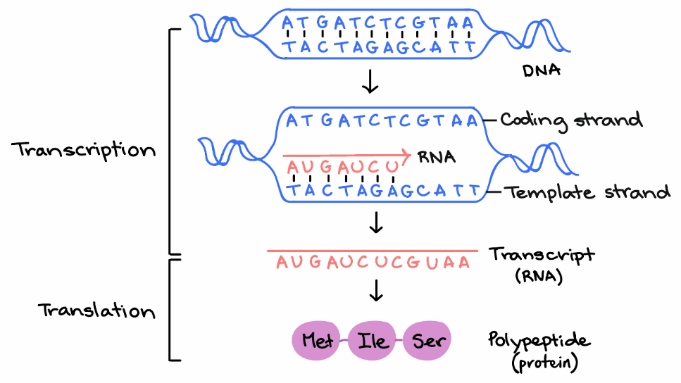

# ORF calling

The first step in identifying the functions of proteins is identifying the genes that encode those proteins. This is called `ORF calling` because we are identifying the *ORFs* &mdash; open reading frames. The protein is the main component of the cell that actually does the work!

Here is a brief recap on the [central dogma of biology](https://en.wikipedia.org/wiki/Central_dogma_of_molecular_biology), the concept that DNA makes RNA makes protein. The image is courtesy of, and copyright 2018, Katelyn McNair.



Notice that DNA is encoded in groups of three bases, called a `codon`. (Each `codon` is `3 bp long`, and they are non-overlapping). 

There are 4<sup>3</sup> = 64 possibilities of choosing three letters from an alphabet of four letters {A, T, C, G}:

Codon | Amino Acid | Codon | Amino Acid | Codon | Amino Acid | Codon | Amino Acid
--- | --- | --- | --- | --- | --- | --- | --- 
AAA | Lys | CAA | Gln | GAA | Glu | **TAA** | **Stop**
AAC | Asn | CAC | His | GAC | Asp | TAC | Tyr
AAG | Lys | CAG | Gln | GAG | Glu | **TAG** | **Stop**
AAT | Asn | CAT | His | GAT | Asp | TAT | Tyr
ACA | Thr | CCA | Pro | GCA | Ala | TCA | Ser
ACC | Thr | CCC | Pro | GCC | Ala | TCC | Ser
ACG | Thr | CCG | Pro | GCG | Ala | TCG | Ser
ACT | Thr | CCT | Pro | GCT | Ala | TCT | Ser
AGA | Arg | CGA | Arg | GGA | Gly | **TGA** | **Stop**
AGC | Ser | CGC | Arg | GGC | Gly | TGC | Cys
AGG | Arg | CGG | Arg | GGG | Gly | TGG | Trp
AGT | Ser | CGT | Arg | GGT | Gly | TGT | Cys
ATA | Ile | CTA | Leu | GTA | Val | TTA | Leu
ATC | Ile | CTC | Leu | GTC | Val | TTC | Phe
**ATG** | **Met** | CTG | Leu | GTG | Val | TTG | Leu
ATT | Ile | CTT | Leu | GTT | Val | TTT | Phe


Note that in this table above I have just sorted the codons alphabetically. There are [several other ways](https://www.google.com/search?tbm=isch&q=codon+usage+table&chips=q:codon+usage+table) to present the same data, many of which are designed to be easier to navigate for manual translation of DNA sequences.

Notice that there is only one codon that encodes Methionine. A derivative of methionine, called [N-formyl methionine](https://en.wikipedia.org/wiki/N-Formylmethionine) is required to start all proteins. N-formyl methionine is encoded by ATG, and thus this is typically (but not always) the start codon. Occasionally CTG or GTG can be used as alternative start codons, however the protein has to start with N-formyl methionine regardless of the codon used.

There are three *special* codons, **TAG**, **TAA**, and **TGA** encode a special amino acid - *Stop!*. They don't really encode an amino acid, in fact what they encode is nothing. This causes the [ribosome](https://en.wikipedia.org/wiki/Ribosome), the machinery that translates DNA into protein, to stall, and the nascent protein is released and translation stops.

## Open reading frames

An open reading frame is a stretch of DNA that can be translated into amino acids and does not contain a stop codon.

This may or may not be made into a protein, it just denotes a region in the genome that has the *potential* to be made into a protein!

## Why are there six reading frames in DNA sequence?

Remember that DNA is read in `codons` consisting of three bases, and DNA is read in a non-overlapping manner. Thus the DNA sequence:

```
    ATG ATC ATT GAC TAT TAA                                                                 (1)
```
could equally well be read:

```
    A TGA TCA TTG ACT ATT AA                                                               (2)
```
or

```
    AT GAT CAT TGA CTA TTA A                                                               (3)
```
however, note that if we shift our register over one more time, we get back to the first case:

```
    ATG ATC ATT GAC TAT TAA                                                                 (1)
```

Then, recall that DNA can be read in the other direction. We normally write the sequence from the 5' end to the 3' end of the sequence. (The numbers here refer to the free carbons in the DNA's ribose backbone - at one end the carbon called the 5'-carbon is free and will have a phosphate group attached. At the other end, the 3' end is free and there is an OH molecule attached.)

Thus, this DNA sequence can also be read

```
    5' - ATG ATC ATT GAC TAT TAA - 3'
    3' - TAC TAG TAA CTG ATA ATT - 5'
```

Then we can read the `complementary strand` (the strand whose sequence is TACTAGTAACTGATAATT) from the right to the left. Again, and for the same reasons as above, we can read that in three different ways depending on where we start, but when we get to the fourth potential start, we're back at the beginning:

```
    TAC TAG TAA CTG ATA ATT                                                     (-1)

    T ACT AGT AAC TGA TAA TT                                                   (-2)

    TA CTA GTA ACT GAT AAT T                                                   (-3)
```

An open reading frame can be *any* stretch of DNA that does not contain a sequence.

*Thought experiment:* In the above sequences, how many open reading frames are there?

## How do we identify open reading frames?


