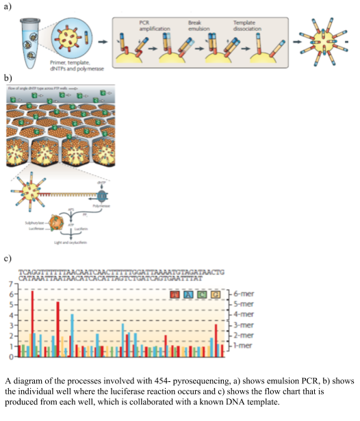
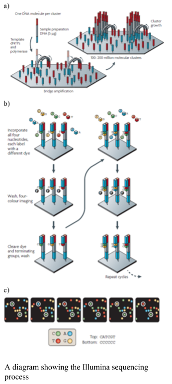
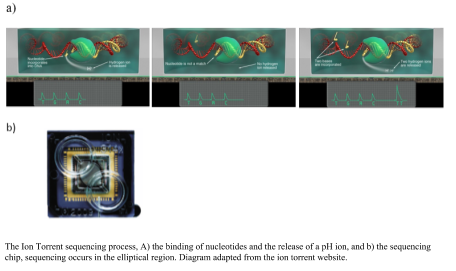
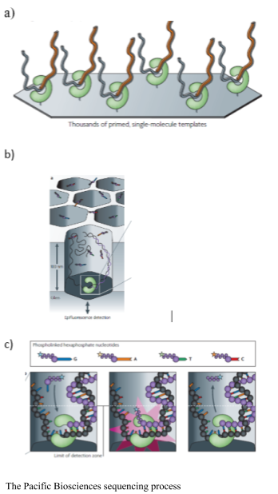
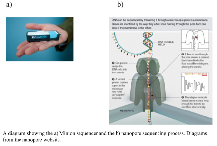
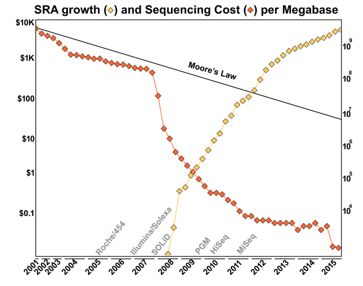

# Sequencing.

Biological sciences has a long and storied history of natural science – identifying, cataloging, and classifying organisms in different environments. Every aspect of biological sciences is being revolutionized by two dominant technologies: cheap and ubiquitous access to DNA sequencing, and cheap and ubiquitous access to high performance computing. Molecular biology was forever altered by the introduction of the polymerase chain reaction (PCR), and that invention, more than any other, has enabled the sequencing revolution. 

Taxonomy, one of the oldest endeavors of the biologist, is changing from characterizing organisms based on morphology to characterizing organisms based on DNA sequences. Revisionist taxonomic approaches are being introduced throughout the tree of life, and no branch on the tree can avoid the sequencing machine. For example, microbial and viral taxonomy are being completely rewritten because of the analysis of DNA sequences (Rohwer & Edwards, 2002; Thompson et al., 2015). All aspects of ecology are being affected by the introduction of DNA sequencing: for example, in the marine environment the ecology of everything from the largest (Cammen et al., 2016) to the smallest (Chow & Suttle, 2015; Haggerty & Dinsdale, 2017) organisms is being revised because of sequence analysis. Evolutionary theories about plants and animals are being upended because of the introduction of genome skimming techniques and deep sequencing (Hollingsworth et al., 2016). 

# Sanger Sequencing

Two-time nobel Laureate [Dr. Fred Sanger](https://en.wikipedia.org/wiki/Frederick_Sanger) developed this sequencing technology in 1977. The approach uses terminators, dideoxynucleotide triphosphates (ddNTPs), that terminate DNA extension during replication and do not allow the strand to be synthesized further. Thus, every time a ddNTP is added to the growing DNA strand, synthesis stops and the fragement can not be made any longer. Initially we used radioactivity to identify the DNA fragments, as shown in this figure.

Each band represents a bunch of DNA fragments that have been terminated at the same place. Since there are four ddNTPs &em; ddGTP, ddCTP, ddTTP, and ddATP &em; you can read off the sequence of the strands. Initially, the DNA was separated on large polyacrylamide gels, but a big improvement was the introduction of thin tubes containing the polyacrylamide gels. Associated with that, the introduction of fluorescently labeled nucleotides allowed the terminated fragments to be read automatically. This is the technology that was used to sequence the first version of the human genome.

Sanger sequencing is still used today. It has two advantages that none of the modern sequencing approaches can match: 
1. Longer sequence length. Typically Sanger sequences will be 700+ bases of usable sequence and can approach 1kb.
2. Low throughput. Somewhat unexpectedly, the low throughput of Sanger sequencing is an advantage if, for example, you want to sequence a single clone.

Sanger sequencing is largely used to sequence one, or a few, clones. For example, this chromatogram comes from a [global survey of a phage](https://github.com/linsalrob/crAssphage/) called crAssphage that was performed by PCR amplifying a region of the crAssphage genome and then sequencing those PCR products using Sanger sequencing technology.

In the image, each of the bases, A (green), C (blue), G (black), and T (red) are shown by the trace. The peaks indicate where the bases are. Remember that the sequences are separated through a gel matrix, and so the band of DNA has a distribution associated with how quickly it migrates through the gel matrix. Note that at the beginning of the sequence the sequencer is unable to accurately identify the peaks because the signal is so strong. Similarly, at the end of the sequence the quality degrades because the peaks begin to be too spread out and start merging together. The grey bars above each peak indicate the quality of the sequence, and the suggested base call is shown in the appropriate color. There are some ambiguities in this sequence. Check the bases at position 255 and see if you agree with the base that was called by the program. *Why or why not?*

# High throughput DNA sequencing technologies

The sequencing of the human genome in 2001 changed forever the DNA sequencing process and began the race for the development of the fastest, cheapest and most accurate sequencers (Collins et al., 2003). Sanger sequencing was focused on the identification of long pieces of DNA taken from a known region of the genomes, the next generation sequencers were focused on obtaining multiple small pieces of DNA from a random (unknown) area of the genome and sequencing them rapidly. The identification of where the DNA sequences came was positioned in the genome became the preserve of bioinformatics. The major technological challenges were to immobilize the random pieces of DNA, thus enabling amplification of a single strand to afford detection of the signal. Most of the next generation sequencers, conducted the process by sequencing by synthesis, where a complementary strand of DNA was synthesized and a measurable physical change occurred with addition of each nucleotide. The sequencing technologies vary in the mode of library preparation, amplification, immobilization, and signal detection. In most cases amplification of the template is required because detection of a single fluorescent or luminescent event is not possible. 

**454 pyrosequencing** was one of the earlier next generation sequencing technologies developed, using the chemical reaction of sulfurylase and luciferase to produce light on the incorporation of a nucleotide.  The sulfurylase/luciferase chemistry was developed in 1987 (Nyrén, 1987) and further developed in 1996, where the level of light produced titrated with the number of nucleotides incorporated (Ronaghi et al., 1996). To prepare the libraries the DNA was sheared, blunt ended and distinct linkers were added to the 3’ and 5’ ends. The DNA templates were amplified using emulsion PCR, where one bead and one template is placed into oil emulsion and the DNA template is immobilized onto the bead and the DNA amplified within an oil bubble (panel A in the figure). Problems occur at this step, where two beads in one oil well would create a duplicate read, which needs to be removed after sequencing, alternatively two pieces of DNA with one bead in an oil bubble will cause a mixed bead which are removed from the sequencing process via a washing step. The beads with the clonal amplified DNA are placed into a microtiter plate and surrounded by smaller packing and chemical coated beads. The nucleotides are flowed over the wells of the micro-titre plate, and as they bind the complementary nucleotide, the polymerase pauses and a pyrophosphate (PPi) is released in equal molarity to the binding of the nucleotides and converted to ATP via sulfurylase. The luciferase assay proceeds and light is produced and visualized using a CCT camera. The 454 pyrosequencing system was able to produce 1,000,000 reads up to ~700 bp long. The visualized light was interpreted into a flowchart (as shown in the figure), using a known DNA sample to calibrate the each run. A drawback of the system was the mistakes in homopolymer regions, due to the inaccuracy of the amplification of the light, cross talk between wells, out of phase errors. The time and expense of the system, however, reduced it popularity in the marketplace.  An advantage of the sequencer was the longer sequences that were produced. 

**Illumina** uses solid phase amplification, where a template strand is immobilized onto a glass slide and each template is amplified into multiple clusters (as shown in the figure). The slide has oligos bound to it, where the DNA strand attaches and bridge amplification proceeds to create the cluster (as shown in the figure). Because the clusters are amplified on one slide there is no need for the individual wells, like the 454 and ion torrent, enabling a higher number of clusters to be formed. Therefore, the process produces 100 - 200 million spatially separated clusters for sequencing. The length of these sequences is limited. Over-clustering will cause the same template to be amplified multiple times, causing duplicate reads, which need to be removed after sequencing. The Illumina library preparation requires fragmenting of the DNA, addition of primers and tags and then making the templates into a single strand. The sequencing process uses the cycling reverse termination, where fluorescent nucleotides are flowed over the sequences and incorporated into the complementary nucleotide. The process is paused and the non-bound nucleotides are washed away. The Fluorescence is measured using two lasers and the fluorophore cleaved. The flow cell is washed to remove the fluorophores prior to the next cycle. Errors in the Illumina are associated with substitutions. The newer models of Illumina have reduced the number of fluorophores to three and the imagine processing to one laser, thus have one silent nucleotide.

**Ion Torrent** sequencing was developed from the 454 platform, but instead of using light to measure the binding of the nucleotides it measures a change in pH. The library preparation uses an emulsion PCR. Nucleotides are flowed over the well, made from a computer chip, and the complementary nucleotide binds a hydrogen ion is released, if there is no binding there is no release of a hydrogen ion (as shown in the figure). The binding of multiple nucleotides in a row, result in a larger number of hydrogen ions released and a higher recording of the level of change in the pH. The advantages of the Ion Torrent are the fast sequencing time; however the capacity is lower than the Illumina reducing the use in the marketplace. Using pH to measure the DNA sequence producers a more robust instrument, which is useful in field situation, for example being able to sequence on a ship (Lim et al., 2014).

The **Pacific Biosciences** SMRT sequencer immobilizes a DNA polymerase onto a solid surface and single DNA template is bound to the polymerase. The binding of a single molecule allows for longer sequences to be sequenced. The sequencing is real time as the process does not stop to cleave the fluorophore. Pacific Biosciences uses Phi 29 polymerase, which is highly processive, and allows for resequencing of a single circular molecule. Phospholinked hexaphosphate nucleotides are incorporated into the growing DNA molecule within a small viewing range within the zero-mode waveguide detectors. The detectors are illuminated from the bottom, for 20-30 nm into the detector, making it an extremely small microscope. The fluorescent pulse is detected upon binding; while the DNA strand is within the range of the detector and then it is cleaved and diffuses away from the detector area. The process does not require continual flushing and washing. The resequencing increases accuracy of the platform (Eid et al., 2009).

This Pacific Biosciences YouTube video shows you more detail about how the sequencing works (click the picture to go to YouTube):

The **Oxford Nanopore Minion** uses a nano-scale hole that can be used to electrophorically drive a biological molecule through and measure the change in current as the biological molecule passes through the pore (Metzker, 2010). The hole is made by a protein punching a hole in a membrane (biological nanopore) or a hole punched through a solid product (solid state nanopores).  As the DNA flows through the pore the difference is size of the nucleotides changes the ionic charge flowing through the pore. The difference in charge is measured and related to the size of the nucleotide. The DNA sample does not need amplification; the greater the amount of DNA, the greater number and length of DNA sequences that are obtained, however. The library preparation requires minimal fragmentation and there are a couple of different approaches. In the 1D approach, only one of the strands is read without  the ligation of two adaptors. An alternative is the 2D approach, in which the first adaptor is bound with a propriety motor enzyme and a molecular tether. The second adaptor is a hairpin oligonucleotide bound by a second motor (Reuter, Spacek & Snyder, 2015). The hairpin loop allows for both sides of the double stranded to be sequenced. The speed at which unbound DNA moved through the pore provides for rapid sequencing, but this was an initial problem for obtaining an accurate measurement (Branton et al., 2008). The accuracy has increased and the minion has 510 nanopores from which to process DNA and fast library preparation times. The length of sequences is up to several hundred base pairs. The speed and ease of the sequencer will allow for sequencing almost anywhere in the field.

# Pros and Cons of the technologies

Each of the sequencing technologies has advantages and disadvantages.

For example:
* Illumina &em; accurate sequencing; short reads (150+ bp); billions of sequences; long run time
* 454 &em; susceptible to homopolymeric errors, long reads (500+ bp); millions of sequences; 8 hour run
* Ion torrent &em; longer reads (500+ bp); millions of sequences; mate-pair libraries; fast 2 hr run
* Pac Bio &em; very long sequences (kbp to mbp); single molecule sequencing; DNA often falls off the polymerase; expensive
* Nanopore &em; long sequences (kbp to mbp); minimal chemistry and sample prep; cheap; lower accuracy (currently ~90%); fast

# Cost of DNA sequencing

Over the years, the cost of DNA sequencing has dropped dramatically! In the 1980's the argument was that it would be cost-effective to sequence the human genome when the price of DNA sequencing was about 0.5&#162; per base pair. Nowadays the cost of sequencing is about 1.2&#162; per **mega**base pair - so about 0.0000012&#162; per base pair! You can find out more about the cost of DNA sequencing from the [NIH website that tracks the cost](https://www.genome.gov/sequencingcostsdata/). 

## Why has sequencing become so cheap?

The main reason is because of the introduction of new sequencing technology, especially that driven by the Illumina sequencer. As shown in this Figure from the Ph.D. thesis of Dr. Genivaldo Silva: [Who Is There and What Are They Doing? An Agile and Computationally Efficient Framework for Genome Discovery and Annotation from Metagenomic Big Data](https://sdsu-primo.hosted.exlibrisgroup.com/primo-explore/fulldisplay?docid=01CALS_ALMA71478140820002901&context=L&vid=01CALS_SDL&search_scope=EVERYTHING&tab=everything&lang=en_US), the cost of DNA sequencing has taken a dramatic drop with each new technological innovation!

# Errors in DNA sequencing

Each of the sequencing technologies is susceptible to different error rates. They are summarized in the table below:

| Sequencing Technology | Primary Errors |  Error Rate
 --- | --- | ---
Capillary Sanger Sequencing | substitutions | 0.1 %
454 FLX | Indel | 1 %
PacBio SMRT | CG deletions | 13 %
Oxford Nanopore | deletions | 7 %
Ion Torrent | indels | 1 %
Illumina | substitutions | 0.1 %

(Sources [molecular ecologist](http://www.molecularecologist.com/next-gen-table-3c-2014/), [Ross *et al*](https://genomebiology.biomedcentral.com/articles/10.1186/gb-2013-14-5-r51), [Glenn](https://onlinelibrary.wiley.com/doi/epdf/10.1111/j.1755-0998.2011.03024.x), [Weirather *et al*](https://f1000research.com/articles/6-100/v2) and personal experience!)

However, in many cases the final error is significantly better than that reported here because, for example, both Nanopore and PacBio can sequence the same molecule several times, and then reduce their effective error rate. With Pac Bio SMRT sequencing the DNA molecule does not get released from the polymerase. Nanopore 2D-sequencing was designed to reduce the error rate by reading the DNA strand in the one direction, around a loop, and then reading the same molecule back again.

However, for downstream analyses we need to estimate the error rates of the DNA sequences. Essentially every technology does this the same way.

*Thought Experiment*: Lets say you start with a well known sequence like &Phi;X174 which was sequenced back in 1978 (by [Fred Sanger, of Sanger sequencing!](https://www.ncbi.nlm.nih.gov/pubmed/731693)), how would you estimate the error rate of a new sequencing technology?[1](#footnote1)

One of the first base callers to build error models of sequences was called [Phred](http://www.phrap.com/phred/), developed by Phil Green and Brent Ewing. They developed the notion of a *phred score* for each base of the sequence. The phred score is the logarithm of the base-calling error probabilities:

Q = -10 log10(Pe)

Where Q is the quality score, and Pe is the probability of error in the base call. Quality scores range from 0 to 99, although 99 is usually used to mean that you have artificially inserted a sequence at that position (e.g. through manually editing the sequence). The meaning of quality scores are shown in the two tables below.

* Phred 10: 1 x 101 chance that the base is wrong
* Phred 20: 1 x 102 chance that the base is wrong
* Phred 30: 1 x 103 chance that the base is wrong
* Phred 40: 1 x 104 chance that the base is wrong

Alternatively:

Phred Quality Score | Probability of an incorrect base call | Base calling accuracy
:------: | :------: | :------:
10 | 1 in 10 | 90%
20 | 1 in 100 | 99%
30 | 1 in 1000 | 99.9%
40 | 1 in 10,000 | 99.99%
50 | 1 in 100,000 | 99.999%
60 | 1 in 1,000,000 | 99.9999%

Thus, if you see a quality score of 40, you can be very sure that the sequence is correct, while a quality score of 10 should have you worried about the quality. 

Nowadays, however, the sequencing is a lot more accurate. As shown above, Illumina sequencing is accurate on the per base calling problem (although it has issues with template switching during sequencing). Minion sequencing and PacBio sequencing are both getting more accurate, and their errors tend to be less predictable and more stochastic. However, they both use phred scores to justify the quality of their sequences.

<a name="footnote1">1</a> Answer: You repeatedly sequence the same molecule over and over again, and each time you basecall the sequences you can build a model of your error distribution. In reality, you don't only use &Phi;X174, but you sequence several different genomes, each with different characteristics (e.g. repetative elements, %GC, etc) to build robust error models of different sequences.
