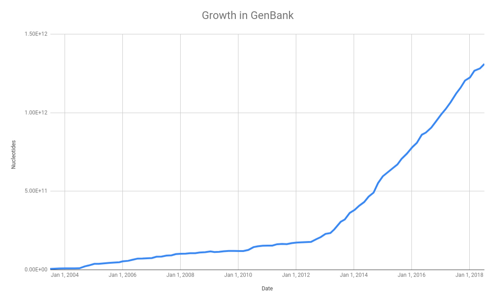
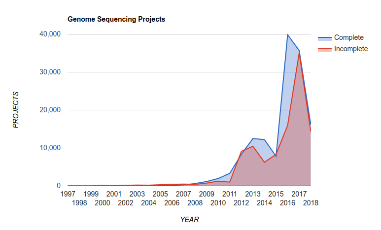
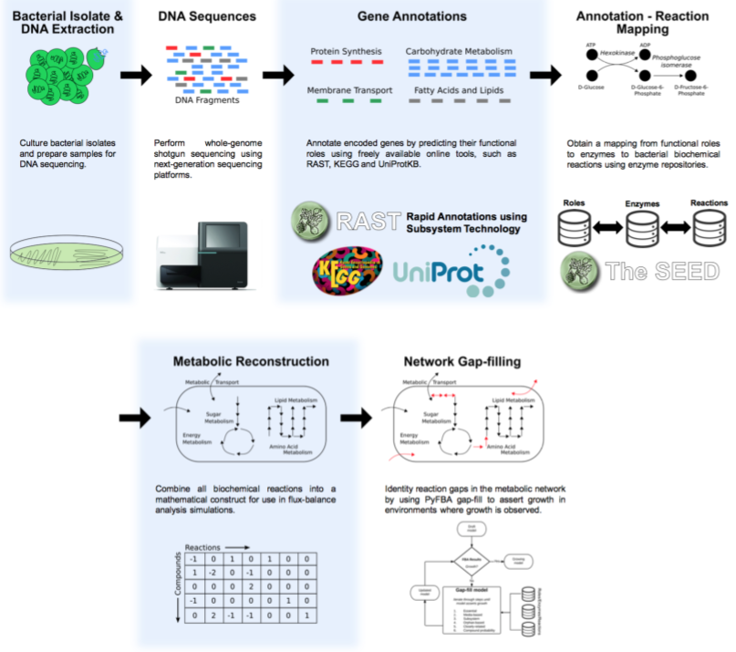

# Whole Genome Shotgun Sequencing

Before we begin, some thought experiments:

*Thought experiment*: How big are genomes of phages, Bacteria, Archaea, Eukarya?[1](#footnote1)

*Thought experiment*: Suppose that you want to sequence the genome of a bacteria that is 1,000,000 bp and you are using a sequencing technology that reads 1,000 bp at a time. What is the least number of reads you could use to sequence that genome?[2](#footnote2)

A long time ago, when sequencing was expensive, these two questions kept people awake. For example, Lander and Waterman published a paper [describing the number of clones that need to be mapped (sequenced)](https://www.ncbi.nlm.nih.gov/pubmed/3294162) to achieve representative coverage of the genome. Part of this theoretical paper is to discuss how many clones would be needed to cover the whole genome. In those days, the clones were broken down into smaller fragments, and so on and so on, and then the fewest possible fragments sequenced. Because the order of those clones was known (from genetics and restriction mapping), it was easy to put them back together.

In 1995, a [breakthrough paper was published in Science](http://science.sciencemag.org/content/269/5223/496) which the whole genome was just randomly sheared, lots and lots of fragments sequenced, and then big (or big for the time &mdash; your cell phone is probably computationally more powerful!) computers used to assemble the genome.

This breakthrough really unleashed the genomics era, and opened the door for genome sequencing including the data that we are going to discuss here!

As we discussed in the [databases](../Databases/) class, the NCBI GenBank database is a central repository for all the microbial genomes. In their [release notes](ftp://ftp.ncbi.nih.gov/refseq/release/release-statistics/bacteria.acc_taxid_growth.txt) they summarize the growth in the number of bases over the last few years:

and this translates into a growth in the number of complete microbial genomes released over the last few years as reported in the [Genomes Online Database](https://gold.jgi.doe.gov/statistics):

There are now over 300,000 complete genomes in the GOLD database! *Read the last version of their paper [Genomes OnLine Database (GOLD) v.6: data updates and feature enhancements Nucl. Acids Res. (2016); doi: 10.1093/nar/gkw992](https://www.ncbi.nlm.nih.gov/pmc/articles/PMC5210664/)*

Also, at the time of writing this (September, 2018), [PATRIC](http://patricbrc.org) reported [177,395 bacterial genomes](https://www.patricbrc.org/view/Taxonomy/2) in their database.

*Thought experiment*: Back in the 1990s, we had a few tens of genomes. In the late-1990s we were betting on whether we would reach 100 complete genomes. What happened? Why do we now have hundreds of thousands of genomes?[3](#footnote3)

## How do we sequence a genome?

*Though experiment*: How much sequencing do you need for a bacterial genome?[4](#footnote4)

---
<a name="footnote1">1</a> Answer: on average, phages are 50kb, Bacteria and Archaea are 2 Mb, and Eukarya are 2GB

<a name="footnote2">2</a> Answer: Of course, if you knew exactly the order of the reads, you could sequence 1,000 reads and sequence the whole genome.

<a name="footnote3">3</a> Answer: First, [the cost of sequencing](../Sequencing/README.md#cost-of-dna-sequencing) dropped drastically, and second, we realized the amazing amount of information we can get from hundreds of genomes.

<a name="footnote4">4</a> Answer: The average bacterial genome is about 2,000,000 bp, and for good assembly with Illumina data you need about 100x coverage, so you need about 0.2 Gbp (200,000,000 bp) of sequence data. Therefore, you can sequence a lot of genomes on a HiSeq! However, assembly is much better with long read systems like the Minion or PacBio.

